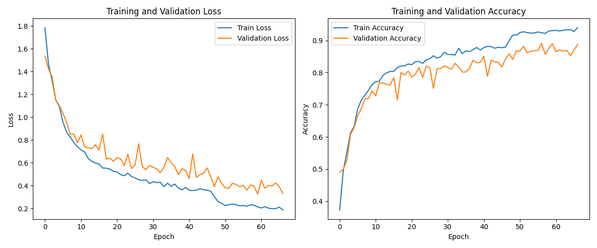
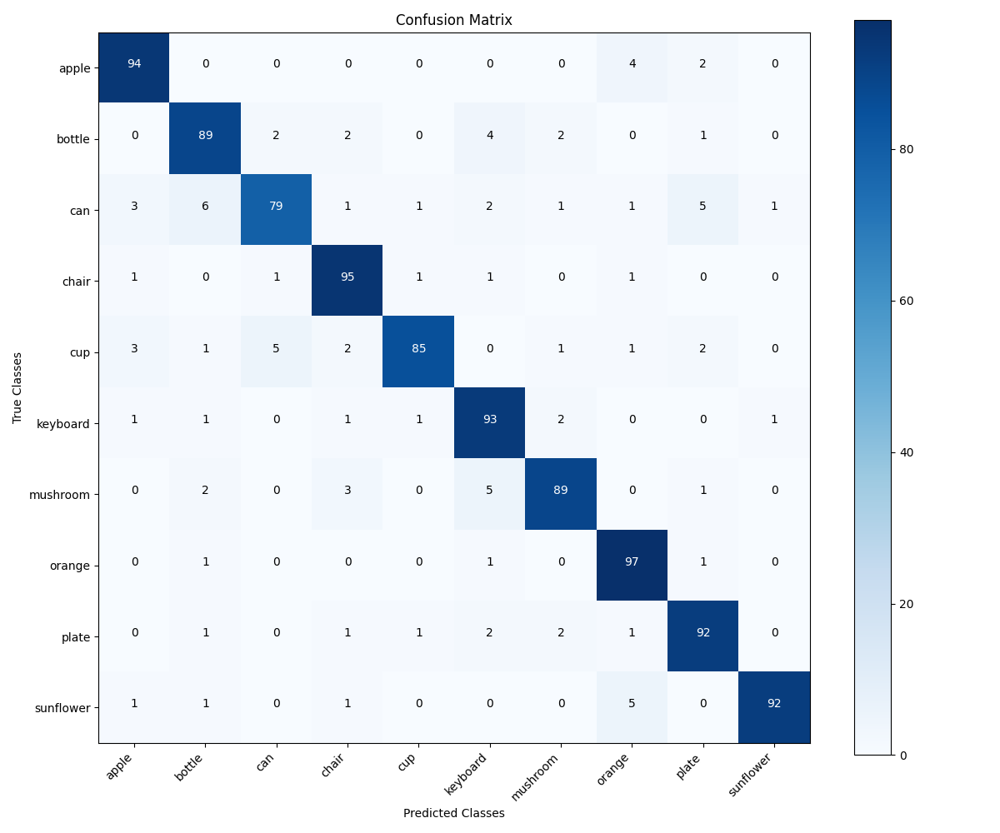

# Real-Time Object Recognition

Real-time object recognition with a from-scratch PyTorch CNN, running live on a webcam.


<!-- TODO: record webcam demo GIF -->

## What it is

I built a convolutional neural network from scratch (no transfer learning) that
recognizes 10 everyday classroom/office objects, and wrapped it in a real-time
webcam demo. The model is trained on a subset of CIFAR-100 and reaches
**90.5% test accuracy**.

The webcam demo classifies a center region of interest (ROI) on every frame and
shows the top-3 predictions with confidence-based colors, temporal smoothing
over the last few frames to stabilize the label, and a live FPS counter.

### Classes

apple, bottle, can, chair, cup, keyboard, mushroom, orange, plate, sunflower

## Model

- Custom CNN with ResNet-style skip connections (~3.25M parameters).
- Three convolutional blocks (64 -> 128 -> 256 channels), each with two
  convolutions, BatchNorm, a residual connection, max pooling and dropout.
- Two fully connected layers (512 units, then 10 outputs) with BatchNorm and
  dropout.

## Training setup

- Dataset: 10-class subset of CIFAR-100 (32x32 RGB), labels remapped to 0-9.
- Split: 80% train / 20% validation, plus the standard CIFAR-100 test set.
- Data augmentation: random crop, horizontal flip, rotation, color jitter.
- Optimizer: Adam (lr 0.001, weight decay 0.001), class-weighted cross-entropy
  to handle class imbalance.
- Scheduler: ReduceLROnPlateau; early stopping on validation accuracy.
- Up to 100 epochs; the best-validation checkpoint is kept.

### Results

Overall test accuracy: **90.5%**.

Training and validation curves:



Confusion matrix on the test set:



## How to run

1. Install dependencies:

   ```bash
   pip install -r requirements.txt
   ```

2. Train (CIFAR-100 downloads automatically to `./data` on first run; the
   dataset is never committed):

   ```bash
   python train.py
   ```

   This trains the model, saves the best weights to
   `simple_classroom_model.pth`, and writes `training_curves.png` and
   `confusion_matrix.png`.

3. Run the real-time webcam demo:

   ```bash
   python webcam.py
   ```

   Controls: `q` quit, `s` save snapshot, `h` toggle help, `f` toggle FPS.

## Weights

The trained model weight (`simple_classroom_model.pth`) is available under
**Releases**. Place it next to the scripts, or run `python train.py` to
regenerate it. CIFAR-100 is downloaded automatically via torchvision.

## Project layout

- `model.py` - CNN architecture and shared configuration.
- `dataset.py` - CIFAR-100 loading, class filtering and label remapping.
- `train.py` - training and evaluation; saves weights and result plots.
- `webcam.py` - loads the trained weights and runs the real-time demo.

## License

MIT. See [LICENSE](LICENSE).
